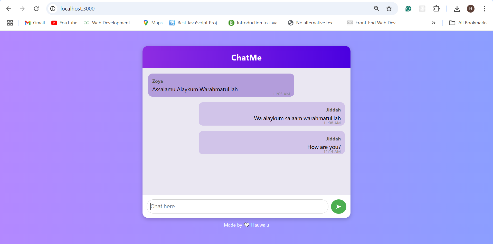

# Real-Time Chat App with Node.js, Socket.IO, and MongoDB

A beginner-friendly real-time chat application built using **Node.js**, **Express**, **Socket.IO**, and **MongoDB**. This app demonstrates the scalability and real-time capabilities of Node.js by allowing users to chat instantly while saving chat messages in a MongoDB database.

---

## 📸 Screenshot



---

## 🚀 Features
- Real-time messaging using WebSockets (Socket.IO)
- Message storage with MongoDB (via Mongoose)
- Loads previous chat messages on page load
- Usernames and timestamps per message
- Responsive, modern UI with chat bubble styling
- Built using scalable architecture

---

## 🛠️ Tech Stack
- **Backend:** Node.js, Express.js, Socket.IO
- **Database:** MongoDB (via MongoDB Compass or Atlas)
- **Frontend:** HTML, Vanilla JS, CSS

---

## 📦 Installation

### 1. Clone the Repository
```bash
git clone https://github.com/yourusername/realtime-chat-app.git
cd realtime-chat-app
```

### 2. Install Dependencies
```bash
npm install
```

### 3. Setup MongoDB
Make sure **MongoDB is running locally** (Compass default setup is fine).
The app uses this connection string by default:
```
mongodb://localhost:27017/chatapp
```
You can change it in `server/server.js` if needed.

---

## 💻 Usage

### Start the App
```bash
node server/server.js
```

### Open in Browser
```
http://localhost:3000
```
Open in multiple tabs to test real-time chat.

---

## 📈 Demonstrating Scalability
This app demonstrates Node.js scalability through:
- **Event-driven architecture** that handles many users with a single thread
- **Non-blocking I/O model** for efficient real-time communication
- Lightweight backend logic ideal for concurrent WebSocket connections

You can test this by:
- Opening 5+ tabs and sending messages
- Monitoring MongoDB for chat message logs

For heavier testing, use ApacheBench or loader.io.

---

## 📂 Project Structure
```
realtime-chat-app/
├── public/
│   ├── index.html
│   └── script.js
├── server/
│   ├── server.js
│   └── models/
│       └── Message.js
├── screenshots/
│   └── chat-ui.png
└── README.md
```

---

## 📜 License
This project is for educational/demo purposes. Feel free to adapt and expand it.

---

## ✍️ Author
**Hauwa'u Jibril Ibrahim**
